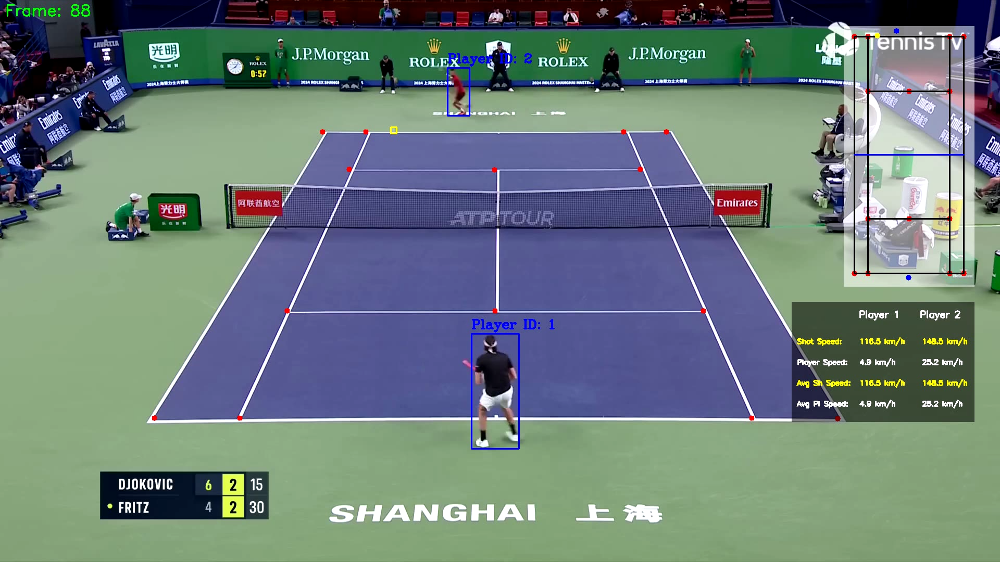

# Tennis-Analysis-YOLO-PyTorch

## About
This project implements a real-time analysis of tennis match videos, tracking players and ball movements using YOLOv5. The system detects player positions and the ball, maps them to a mini-court overlay, and computes key statistics such as shot speed and player speed.

## Methodology
* **Object Detection:** Detect players and the ball in each frame using YOLOv5
* **Improved Ball Detection:** Fine-tuned a pre-trained YOLOv5 model from Roboflow to enhance ball detection in difficult frames
* **Court Keypoints Prediction:** Trained a ResNet50 model on tennis court images to predict court keypoints
* **Mini-Court Visualization and Stats Calculation:**
  - Converted bounding box coordinates to mini-court coordinates
  - Calculated shot speed and player speed based on direction changes of the ball

## Tech Stack
* **YOLOv5:** Real-time object detection
* **Roboflow:** Enhanced YOLO model for robust ball tracking
* **ResNet:** Custom-trained for tennis court keypoints detection
* **OpenCV:** Visualizations and mini-court overlay drawing
